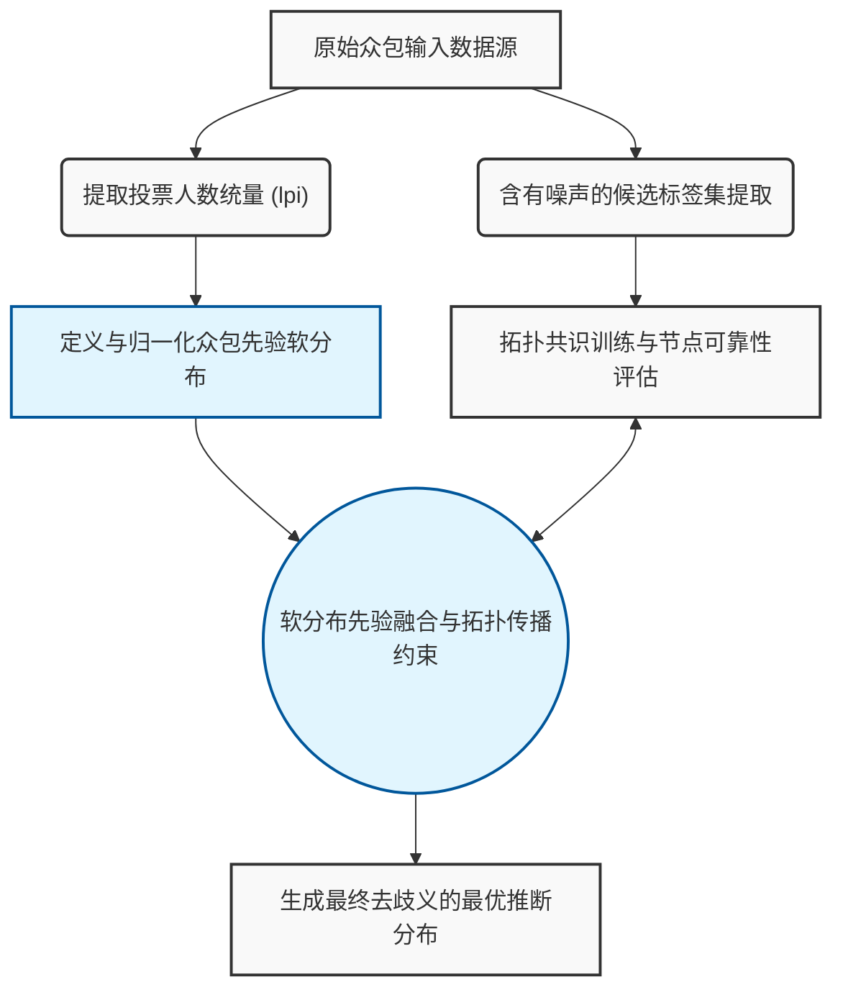

# PALS-SOFT 单流拓扑共识 (Branch 10) 数据集状况说明

本文档旨在客观、严谨地描述本工作区中所采用的数据集的基本假设、噪声模型及相关状态配置。

## 目录
- [1. 含有噪声的候选标签集](#1-含有噪声的候选标签集)
- [2. 基于投票人数 ($lpi$) 的众包先验软分布](#2-基于投票人数-lpi-的众包先验软分布)
- [3. 数据集结构理论流转图](#3-数据集结构理论流转图)

---

## 1. 含有噪声的候选标签集

在当前的验证环境与模型范式中，数据集存在一种被定义为**含有噪声的候选标签集 (Noisy Candidate Label Set)** 的状态。与之对应的弱监督学习 (Weakly Supervised Learning) 及偏标签学习 (Partial Label Learning) 场景表明，鉴于获取专家级确定性标注的成本与困难，系统所处理的底层标注状态是非理想的。

具体特征如下：
* **结构化歧义性**：每个训练实例并未被赋予单一的确切标识（Ground-truth Label），而是被关联到一个候选的标签子集。
* **噪声干扰叠加**：候选标签集中往往由于数据采集系统的系统性偏差、检索误差或低质量标注者的输入，不可避免地夹杂了若干与实例语义不符的错误标签（即“噪声”）。
* 模型的泛化与收敛在此设定下，高度依赖于算法能否在学习自身特征表征的同时，从该含噪闭集中有效地抑制无关噪声标签并实施显式的去歧义 (Disambiguation) 处理。

## 2. 基于投票人数 ($lpi$) 的众包先验软分布

针对包含大量异构平民标注者反馈的**众包数据集 (Crowdsourced Dataset)**，本方案将其离散的标注反馈信号抽象，并严格定义为一种**众包先验软分布 (Crowdsourced Prior Soft Distribution)**。该先验分布是由一个核心变量 $lpi$（即特定标签获得的独立投票人数）直接驱动并量化的。

### 2.1 数理定义与概率映射

假设某个数据实例所涵盖的可能标签类别索引为 $c \in \mathcal{C}$，令 $lpi^{(c)}$ 表示预测或选择类别 $c$ 的独立投票者总频数。为了将其转化为信息论意义下可观测的平滑信念，该实例在众包表征下的先验软概率分布 $P(y=c)$ 可以基于加权经验频率进行显式计算：

$$
P(y=c) = \frac{lpi^{(c)}}{\sum_{j \in \mathcal{C}} lpi^{(j)}}
$$

### 2.2 核心机制与理论优越性

* **认知方差的无损保留 (Lossless Retention of Cognitive Variance )**：相较于将冗杂的众包结果通过多数决 (Majority Voting) 等硬性剪枝策略塌缩为单一的 One-hot 伪标签，基于 $lpi$ 构建的软分布模型能够全息地保留实例在多位标注者中的争议度（方差信息）。分布的熵值高低直观反映了样本自身的语义模糊度或特征辨识难度。
* **先验正则化约束 (Prior Regularization Constraint)**：在单流拓扑共识体系中，将受投票计数的 $lpi$ 张量映射为先验软分布后，可作为重要的数据驱动型正则化锚点。共识网络在迭代演化时，其特征空间不仅旨在提升表征向量的聚类纯度，亦时刻受到该全局群体智能先验分布的指导与纠偏，以此增强面对极端标签噪声时的稳健性 (Robustness)。

## 3. 数据集结构理论流转图

下述流程图展示了上述两种核心数据集假设配置在模型前置流程与共识融合过程中的信息流转交互关系：

